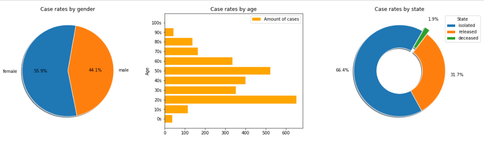
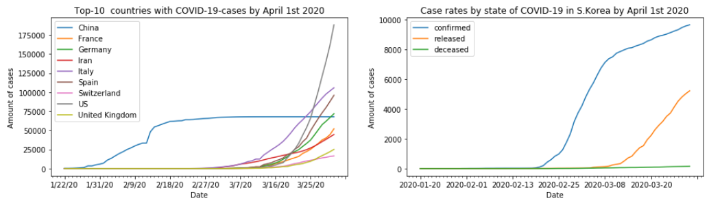

# Project "Covid-19 in South Korea"

This project collects information from South Korea to provide the most comprehensive coronavirus data.
A report was based on :

* identification of business objectives,
* understanding and preparation of data,
* exploratory Analysis/ Modeling
* validation and visualization by using Power Bi, Python in Jupyter Notebook.

The original data was taken from [www.kaggle.com](https://www.kaggle.com/kimjihoo/coronavirusdataset?select=Case.csv)
